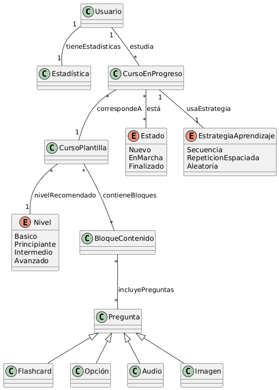

# Modelo de Dominio – Duolingo Baratero

Este es el modelo de dominio de la app Duolingo Baratero. A continuación se explica cómo está organizado el sistema.

---

## Descripción General

Los usuarios pueden crear y estudiar cursos. Cada curso contiene contenido interactivo organizado en bloques y sigue una estrategia de aprendizaje.

---

## Usuarios y Cursos

- Un usuario puede crear y estudiar cursos.  
- Un curso está compuesto por bloques de contenido con ejercicios diseñados para practicar.

---

## Estrategias de Aprendizaje

Cada curso puede seguir uno de estos enfoques:

1. **Secuencial**: el contenido se estudia en un orden fijo.  
2. **Repetitivo**: usa sesiones de repaso espaciadas en el tiempo.  
3. **Aleatorio**: el contenido se presenta en un orden distinto cada vez.

---

## Contenido del Curso

Los cursos se dividen en bloques de contenido. Cada bloque incluye ejercicios, que pueden ser:

- Preguntas de opción múltiple  
- Frases con huecos para completar  
- Ejercicios de escucha (audio)  
- Flashcards para memorizar

---

## Estados del Curso

Un curso puede estar en uno de estos estados:

- **Nuevo**: el usuario aún no lo ha comenzado  
- **En marcha**: el usuario lo está estudiando  
- **Finalizado**: el usuario lo completó

---

## Diagrama del Modelo de Dominio

A continuación se muestra el diagrama que representa la estructura general del sistema:

