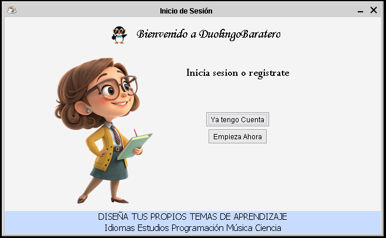
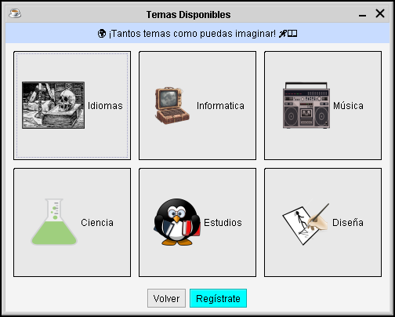
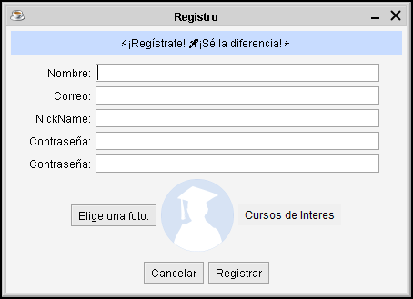
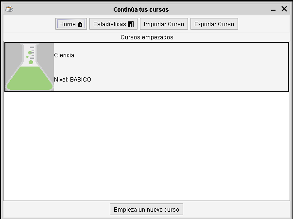
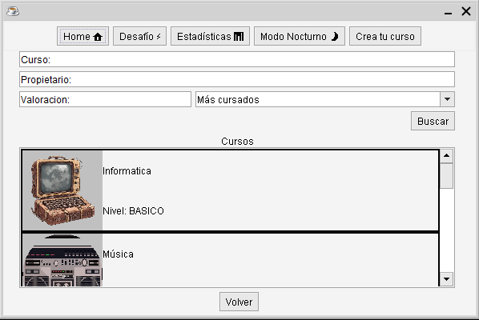
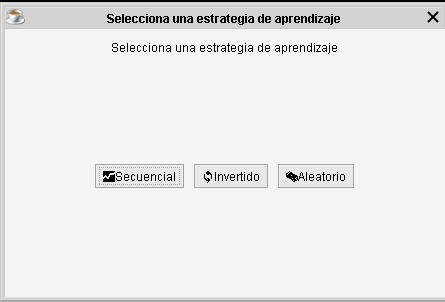
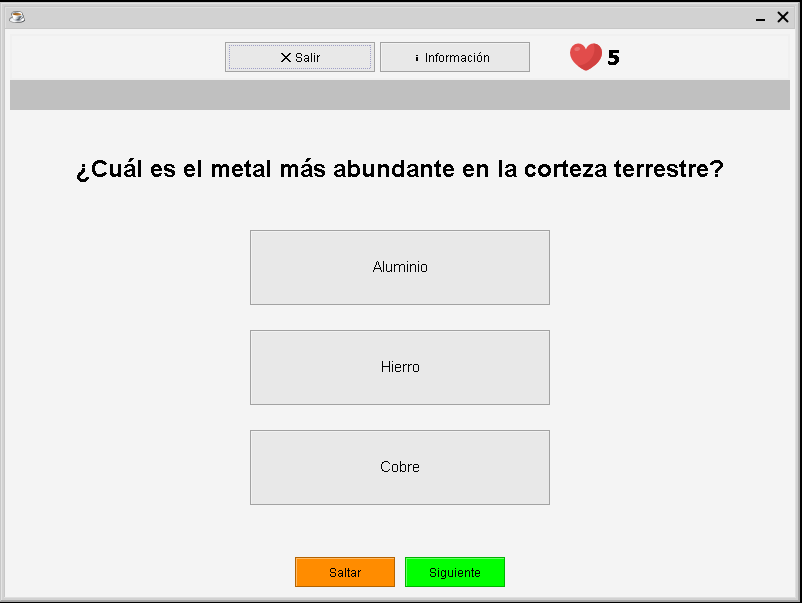
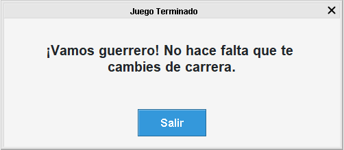
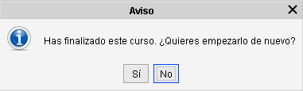

# Manual de Usuario - Aplicación de Escritorio

## Inicio

Al arrancar la aplicación, se mostrará la **ventana de inicio**  

Contiene dos botones:

- **Empieza ahora**:  
  Muestra los cursos disponibles.  
    
  Si estás interesado, haz clic en **Registrarse** y completa el formulario.  
    
  Si los datos son correctos, accederás a la **ventana principal**.

- **Iniciar sesión**:  
  Si ya estás registrado, accede mediante esta opción. Introduce tus credenciales y entrarás en la **ventana principal**.  
  

---

## Ventana Principal

Una vez registrado o logueado, verás la **ventana principal**. En la barra superior encontrarás el menú de navegación con las siguientes opciones:

- **Inicio**: Volver a la ventana principal  
- **Estadísticas**: Ver tu progreso y uso  
- **Importar curso**: Añadir un curso propio  
- **Exportar cursos**: Exportar los cursos disponibles  

Debajo, encontrarás un botón para **empezar un nuevo curso**.  
Esto abrirá la ventana **"Elegir curso"** con los cursos disponibles. Selecciona uno y vuelve a la ventana principal.  

---

## Practicar un Curso

En la ventana principal aparecerán los cursos seleccionados. Para comenzar:

1. Haz clic sobre el curso.
2. Si es la primera vez, se mostrará una ventana para elegir estrategia de aprendizaje:
   - **Secuencial**
   - **Aleatoria**
   - **Aprendizaje espaciado**
3. Se abrirá la **ventana de test**.  

---

## Ventana de Test

En la parte superior contiene:

- **Abandonar práctica**: Pierdes todo el progreso
- **Información**
- **Vidas restantes** (a la derecha)

Debajo:

- **Barra de progreso**: Muestra aciertos, fallos y preguntas restantes
- **Zona central**: Muestra la pregunta
- **Botón siguiente pregunta**
- **Botón para saltar todas las preguntas** (modo prueba)

Al finalizar el test (aprobado o suspendido), se mostrará una ventana con el resultado y un botón para volver a la ventana principal.  

---

## Reglas de Vidas

- Si pierdes todas las vidas, se pierde el progreso.
- Debes esperar a recuperar al menos **1 vida** para volver a practicar.
- El contador de vidas aparece en la barra superior de la ventana principal.
- Con al menos una vida, se muestra cuántas tienes disponibles.

---

## Finalizar Curso

Al completar un curso:

- Puedes **reiniciarlo**
- O **borrarlo**, en cuyo caso desaparecerá

Si decides volver a practicar un curso, se te volverá a preguntar por la **estrategia de aprendizaje**.  

---

## Notas

- El botón para **saltar preguntas** es solo para pruebas y usuarios de test.
