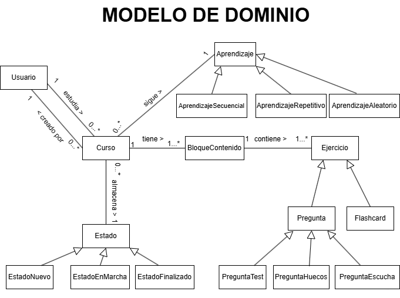

# 📘 Modelo de Dominio - Plataforma de Aprendizaje

Aquí nos encontramos con el modelo de dominio de la aplicación Duolingo Baratero. A continuación, se explica cómo están organizados los elementos principales.

## 📌 Descripción General
El sistema permite a los **usuarios** estudiar y crear cursos, los cuales contienen diferentes tipos de contenido y métodos de aprendizaje.

---

## 🧑‍🎓 Usuarios y Cursos
- Un **usuario** puede **crear** y **estudiar** cursos.
- Un **curso** está compuesto por **bloques de contenido** con ejercicios interactivos.

---

## 📚 Métodos de Aprendizaje
Los cursos pueden seguir diferentes estrategias de aprendizaje:
1. **Aprendizaje Secuencial** → El contenido se estudia en un orden fijo.
2. **Aprendizaje Repetitivo** → El contenido se distribuye en sesiones de repaso en intervalos específicos y progresivamente espaciados en el tiempo.
3. **Aprendizaje Aleatorio** → El contenido se presenta en un orden diferente cada vez.

---

## 🔍 Contenido del Curso
Cada curso está dividido en **bloques de contenido**, que contienen **ejercicios** diseñados para reforzar el aprendizaje.

Los ejercicios pueden incluir:
✔ **Preguntas de Test** (opción múltiple).
✔ **Preguntas de Huecos** (completar frases).
✔ **Preguntas de Escucha** (preguntas basadas en audio).
✔ **Flashcards** (tarjetas de memorización).

---

## 🔄 Estados del Curso
Un curso puede encontrarse en diferentes estados:
- **Nuevo** → El usuario aún no ha comenzado.
- **En Marcha** → El usuario está estudiándolo.
- **Finalizado** → El usuario ha completado el curso.

---

## 📁 Diagrama del Modelo de Dominio
Aquí puedes ver un diagrama que representa la estructura del sistema:

---

📩 **¿Preguntas o sugerencias?** ¡Siéntete libre de abrir un issue o hacer un pull request!
