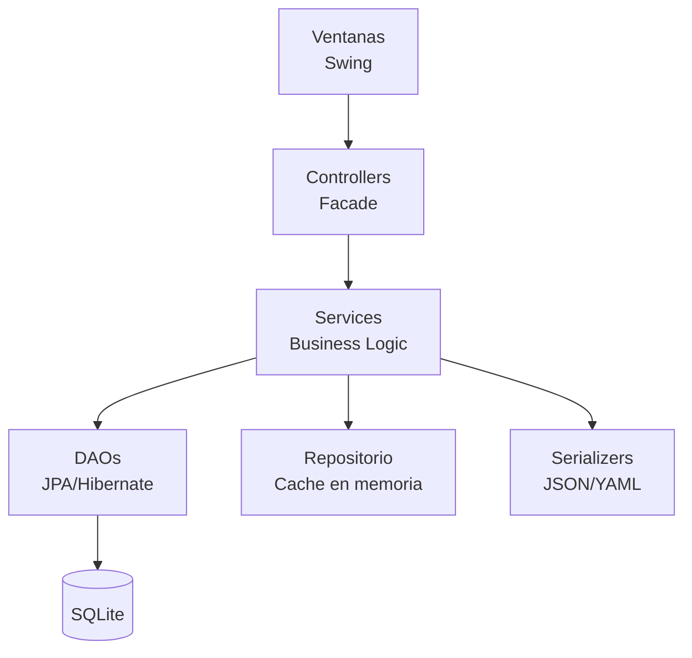

# Duolingo Baratero


En lo que respecta al proyecto, he aquí algunos datos relevantes:

- **Nombre de la aplicación:** Duolingo Baratero.
- **Componentes del grupo:** [Ibrahim Cherif Barry](https://github.com/ibracb), [Alejandro López López](https://github.com/alexlp04), y [Jorge Serrano Rueda](https://github.com/JorgeSR04).
- **Profesor responsable:** Marcial Pamies Berenguer
- **Descripción:** El propósito es desarrollar una aplicación que permita realizar cursos de diferente índole, además de que los usuarios puedan crear sus propios cursos y que puedan ser empleados por otros usuarios. Así, conseguimos que entre los usuarios puedan adquirir conocimiento entre ellos de manera recíproca.
- **Ámbito:** Académico y educativo, correspondiente a la asignatura PDS (Procesos de Desarrollo de Software).
- **Titulación:** Grado de Ingeniería Informática en la Universidad de Murcia.
- **Curso:** 2024-2025.

---

## Guía de Navegación del Repositorio

Este repositorio contiene los recursos relacionados con el diseño, la documentación y los requisitos de la aplicación de escritorio.

---

## Estructura principal

- **[Diseño](./Diseño/)** 
  Carpeta que contiene el modelado del dominio.

- **[Documentacion](./Documentacion/)** 
  Carpeta que incluye el manual de usuario.

- **[Requisitos](./Requisitos/)** 
  Carpeta que contiene casos de uso, imágenes y un índice de requisitos.

---

## Detalle por carpetas

### [Modelo de dominio](./Diseño/ModeloDeDominio/README.md)

- `ModeloDeDominio.png`  
  Imagen del modelado de dominio.

- `ModeloDeDominio.puml`  
  Código fuente en PlantUML del modelo de dominio.

- `README.md`  
  Información detallada sobre el modelo de dominio.

### [Manual de usuario](./Documentacion/README.md)

La funcionalidad del proyecto se encuentra detallada en el manual de usuario. Además, como funcionalidad extra, hemos implementado un sistema de vidas:

- **README.md**  
  Manual de usuario de la aplicación.

---

### [Requisitos](./Requisitos/)

- `README.md`  
  Índice con tabla resumen de los casos de uso.

- `CasosDeUso/`  
  Contiene todos los casos de uso definidos.

- `Ventanas/`  
  Imágenes de las ventanas de la aplicación.

---

## Sistema de vidas (Funcionalidad Extra)

- El usuario comienza con **5 vidas**.
- Por cada pregunta que falle, pierde una vida.
- Las vidas se recuperan automáticamente después de **5 minutos** cada una, hasta un máximo de 5 vidas.

Para gestionar esto, se utiliza un temporizador mientras la aplicación está en funcionamiento. 

Cuando el usuario cierra la aplicación y luego la vuelve a abrir, se toma el último instante en que cerró sesión y el instante actual al abrirla. Se calcula la diferencia entre ambos y, con base en ese tiempo, se actualizan las vidas y el tiempo restante para la próxima regeneración.

---

# Diagrama de arquitectura



- **Ventanas (Swing):** Interfaz gráfica de usuario. Cada ventana delega la lógica en un controller.
- **Controllers:** Facades que median entre la vista y los servicios. Proporcionan una API simplificada.
- **Services:** Lógica de negocio. Orquestan DAOs, aplican reglas y gestionan estado.
- **DAOs (JPA/Hibernate):** Capa de persistencia con CRUD genérico. SQLite como base de datos.
- **Repositorio:** Caché en memoria para consultas rápidas.
- **Serializers:** Import/export de cursos en formato JSON o YAML (patrón Abstract Factory).

---

# Estrategia de pruebas

## Framework y herramientas

- **JUnit 5 (Jupiter):** Framework de pruebas unitarias.
- **Mockito:** Mocking de dependencias para aislar unidades.
- **Ejecución:** `mvn test`

## Niveles de prueba

| Nivel | Qué cubre | Estado |
|-------|-----------|--------|
| Unitarios (models) | Entidades JPA, enums, lógica de negocio | ✅ 64 tests |
| Unitarios (services) | Servicios, filtros, serialización | ✅ 38 tests |
| Unitarios (controllers) | Facades, mediación View→Service | ✅ 75 tests |
| Integración | DAOs + base de datos | ❌ Fuera de alcance |
| UI/Swing | Ventanas y componentes | ❌ Fuera de alcance |

---

# Cómo ejecutar el proyecto `duolingoBaratero`

## Requisitos previos

- JDK 17 instalado
- Apache Maven instalado
- Eclipse IDE (si deseas usar entorno gráfico)

---

## Ejecutar con Maven

```bash
# 1. Clonar el repositorio desde GitHub
git clone https://github.com/ibracb23/duolingoBaratero

# 2. Entrar al directorio del proyecto
cd duolingoBaratero

# 3. Verificar que Maven está instalado
mvn -v

# 4. Compilar el proyecto
mvn compile

# 5. Ejecutar la aplicación
mvn exec:java
```

---

## Ejecutar desde Eclipse

1. Descargar el proyecto desde GitHub  
   Puedes hacerlo de dos formas:

   - Clonando el repositorio:  
     ```bash
     git clone https://github.com/ibracb/duolingoBaratero
     ```
   - O descargando el archivo ZIP desde la página del repositorio y extrayéndolo.

2. Abrir Eclipse  
   - Selecciona un workspace.

3. Importar el proyecto como un **Maven Project**  
   - Ve a: `File > Import > Existing Maven Projects`
   - Selecciona la carpeta del proyecto (`duolingoBaratero`)
   - Asegúrate de que esté usando **JDK 17** como librería.

4. Navegar hasta el archivo principal  
   - Abre: `src/main/java/umu/pds/duolingoBaratero/program/Program.java`

5. Ejecutar el programa  
   - Con el archivo `Program.java` abierto, haz clic en el botón de ejecutar (`Run`) de Eclipse.

---

## Ejecutar tests

### Con Maven

```bash
# Ejecutar todos los tests
mvn test

# Ejecutar un test específico
mvn test -Dtest=NombreDelTest
```

### Desde Eclipse

1. Navega hasta la carpeta de tests: `src/test/java/`
2. Selecciona el test que deseas ejecutar
3. Clic derecho > **Run As** > **JUnit Test**

