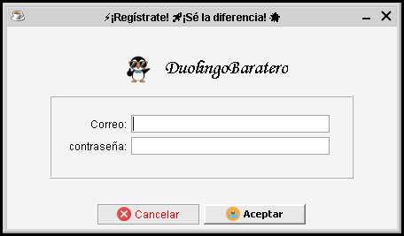
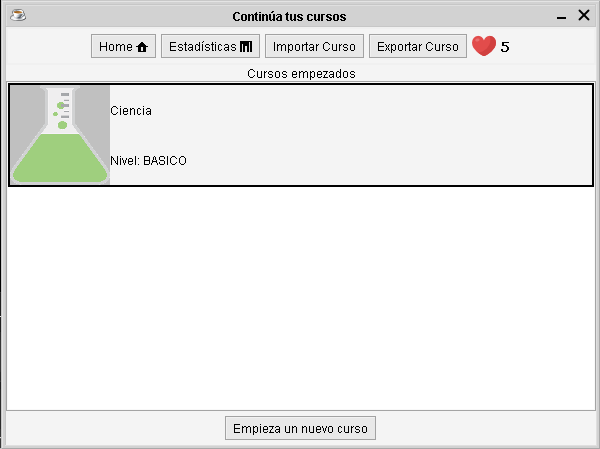
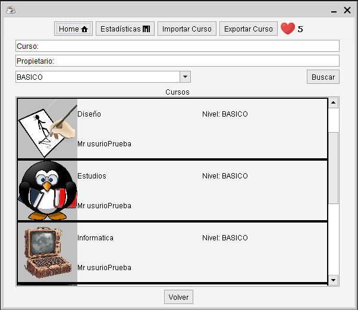
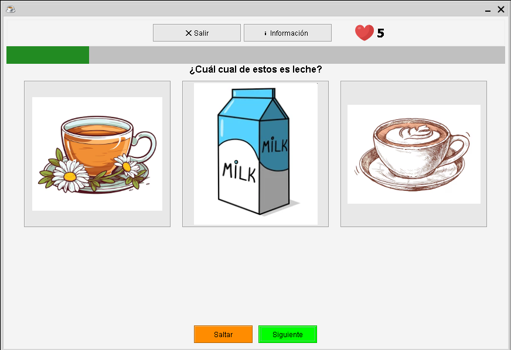
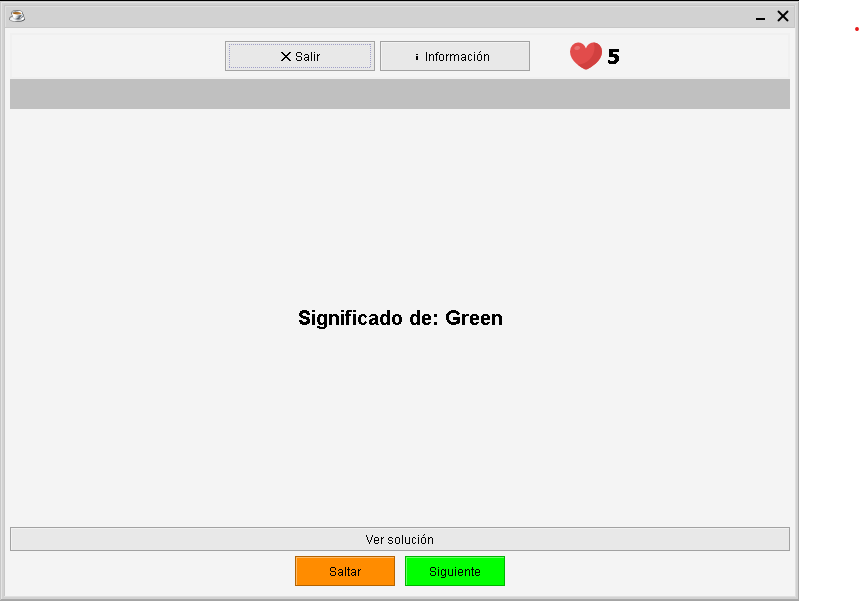
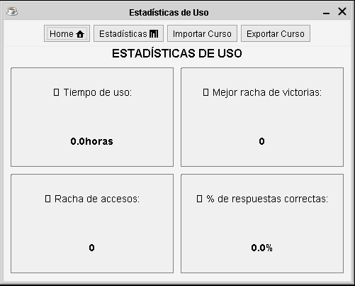
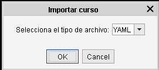

# User manual

Guide to using the Duolingo Baratero application.

## 1. Start

When the application starts, the **start window** is shown, which contains two buttons:

- *Empieza ahora* (Start now): shows the available courses.
- *Iniciar sesión* (Log in): allows you to log in with your credentials if you are already registered.

  

### Register

When you click *Empieza ahora* (Start now), the available courses are shown. If you are interested, click *Registrarse* (Register) and complete the form.

  

  

If the data is correct, you will access the **main window**.

### Log in

If you are already registered, enter your credentials in this option and you will get to the **main window**.

  

## 2. Main window

The top bar contains the navigation menu with the following options:

- *Inicio* (Home): return to the main window.
- *Estadísticas* (Statistics): view your progress and usage.
- *Importar curso* (Import course): add your own course.
- *Exportar cursos* (Export courses): export the available courses.

  

Below there is the button to **start a new course**, which opens the *"Elegir curso"* (Choose course) window with the available courses.

## 3. Choose a course

From the main window, click **start a new course**. Select one and return to the main window.

  

## 4. Practise a course

The selected courses will appear in the main window. To begin:

1. Click on the course.
2. If it is the first time, a window to choose the **learning strategy** is shown:
   - *Secuencial* (Sequential)
   - *Invertido* (Inverted): presents the questions in reverse order to the sequential one.
   - *Aleatorio* (Random)
3. The **test window** will open.

  

## 5. Test window

At the top it contains:

- *Abandonar práctica* (Leave practice): you lose all the progress.
- **Information**.
- **Remaining lives** (on the right).

Below:

- **Progress bar**: shows hits, misses and remaining questions.
- **Central area**: shows the question.
- **Next question button**.
- **Button to skip all the questions** (test mode).

  

When the test finishes (passed or failed), a window is shown with the result and a button to return to the main window.

  

## 6. Question types

In addition to the standard test question, the course can contain other content types:

- **Questions with images**: show the statement accompanied by one or more images.
- **Flashcards**: memorisation cards to review content.

  

  

## 7. Statistics

The *Estadísticas* (Statistics) option in the menu allows you to check your progress and your use of the application.

  

## 8. Import a course

The *Importar curso* (Import course) option allows you to add your own course from a JSON or YAML file.

  

## 9. Lives system

The user starts with **5 lives**. For each question they fail they lose a life, and lives are recovered automatically after **5 minutes** each, up to a maximum of 5.

To manage it, a timer is used while the application is running. When the application is closed and reopened, the last log-out instant and the current instant on opening are taken; the difference is calculated and, based on that time, the lives and the remaining time for the next regeneration are updated.

Lives rules:

- If you lose all your lives, you lose the progress.
- You must wait to recover at least **1 life** to practise again.
- The lives counter appears in the top bar of the main window.
- With at least one life, how many you have available is shown.

## 10. Finish a course

When a course is completed:

- You can **restart** it.
- Or **delete** it, in which case it will disappear.

If you decide to practise a course again, you will be asked again for the **learning strategy**.

  

