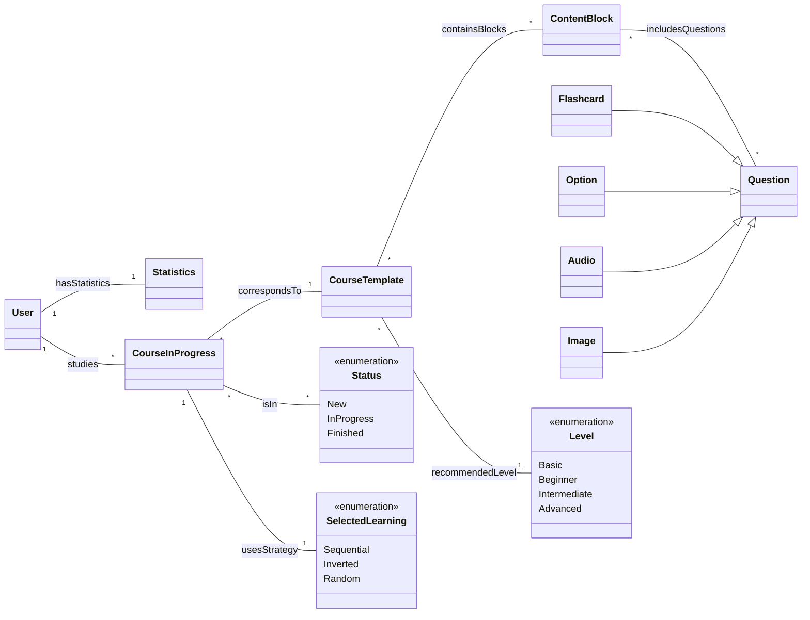

# Domain model

The following explains how the Duolingo Baratero application system is organised.

## General description

Users can create and study courses. Each course contains interactive content organised in blocks and follows a learning strategy.

## Users and courses

- A user can create and study courses.
- A course is made up of content blocks with exercises designed for practising.

## Learning strategies

Each course can follow one of these approaches:

1. **Sequential**: the content is studied in a fixed order.
2. **Inverted**: presents the questions in reverse order to the sequential one.
3. **Random**: the content is presented in a different order each time.

## Course content

Courses are divided into content blocks. Each block includes exercises, which can be:

- Multiple-choice questions.
- Phrases with gaps to complete.
- Listening exercises (audio).
- Flashcards for memorising.

## Course states

A course can be in one of these states:

- **New**: the user has not started it yet.
- **In progress**: the user is studying it.
- **Finished**: the user has completed it.

## Domain model diagram

The following diagram represents the general structure of the system:

