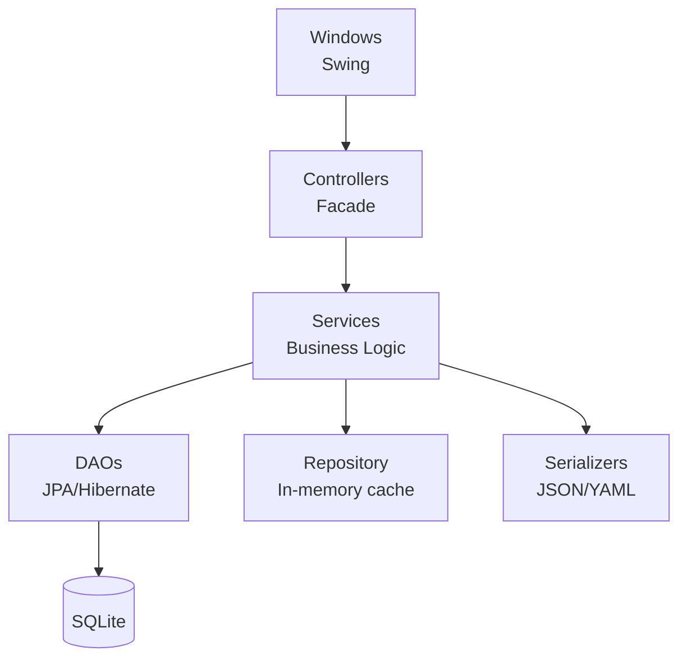

# Architecture

The system is organised in layers, with the graphical interface concentrated in the windows layer and the persistence in the DAOs. However, the separation is not total: the question classes of the model (`Pregunta`, `Flashcard`, `PreguntaAudio`, `PreguntaImagenes`, `PreguntaOpciones`) expose their rendering through `crearPanel()` and depend on Swing (`JPanel`).

- **Windows (Swing):** graphical user interface. Each window delegates the logic to a controller.
- **Controllers:** facades that mediate between the view and the services. They provide a simplified API.
- **Services:** business logic. They orchestrate the DAOs, apply rules and manage state.
- **DAOs (JPA/Hibernate):** persistence layer with generic CRUD. SQLite as the database.
- **Repository:** in-memory cache for quick queries.
- **Serializers:** import/export of courses in JSON or YAML format (Abstract Factory pattern).